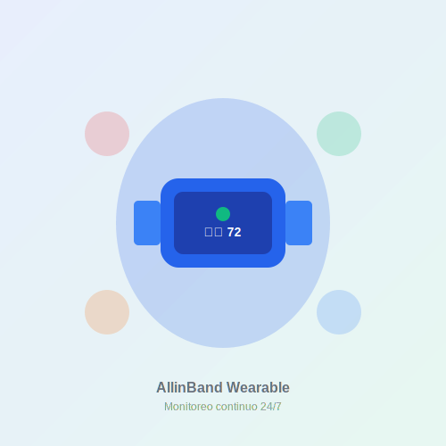

# 🚀 Guía Rápida de Inicio — AllinBand Landing

## 1️⃣ Abrir el Proyecto

### Opción A: Directamente en el navegador

```powershell
# Abre index.html con tu navegador predeterminado
start index.html
```

### Opción B: Con Live Server (VS Code)

1. Instala la extensión **Live Server**
2. Click derecho en `index.html` → "Open with Live Server"
3. Se abrirá en `http://127.0.0.1:5500`

### Opción C: Servidor local con Python

```powershell
# Desde la carpeta del proyecto
python -m http.server 8000
# Abre http://localhost:8000
```

---

## 2️⃣ Personalizar Colores (3 minutos)

1. Abre `css/variables.css`
2. Ve a la línea 12 (`:root`)
3. Cambia estos valores:

```css
/* ANTES (Azul y Verde) */
--color-primary: #2563eb;
--color-secondary: #10b981;

/* DESPUÉS (Ejemplo: Morado y Rosa) */
--color-primary: #8b5cf6;
--color-secondary: #ec4899;
```

4. Guarda y recarga el navegador → ¡Toda la página cambia!

---

## 3️⃣ Editar Contenido

### Cambiar el título principal

**Archivo:** `index.html` (línea ~82)

```html
<h1 class="hero-title">TU NUEVO TÍTULO AQUÍ</h1>
```

### Modificar las secciones

Busca en `index.html`:

- **Hero**: Línea ~65
- **Cómo funciona**: Línea ~115
- **Beneficios**: Línea ~160
- **FAQ**: Línea ~350
- **Formulario**: Línea ~450

---

## 4️⃣ Agregar Imágenes Reales

### Reemplazar el wearable placeholder

1. Crea tu mockup del dispositivo (500x500px)
2. Guarda como `assets/images/wearable-hero.png`
3. En `index.html` línea ~102, cambia:

```html
<!-- DE: -->


<!-- A: -->

```

---

## 5️⃣ Testear el Formulario

1. Abre la página
2. Scroll hasta el final (sección "Únete al piloto")
3. Llena el formulario y envía
4. Abre la **Consola del navegador** (F12)
5. Verás los datos simulados enviados

Para conectar con un backend real, edita `js/form.js` línea ~120

---

## 6️⃣ Deploy a GitHub Pages

```powershell
# 1. Inicializar Git (si no lo hiciste)
git init
git add .
git commit -m "Initial commit"

# 2. Conectar con GitHub
git remote add origin https://github.com/TU-USUARIO/allinband-landing.git
git branch -M main
git push -u origin main

# 3. En GitHub.com:
# Settings → Pages → Source: main branch → Save

# ¡Listo! Tu sitio estará en:
# https://TU-USUARIO.github.io/allinband-landing/
```

---

## 7️⃣ Checklist de Tareas

### Antes del Deploy

- [ ] Reemplazar `wearable-hero.svg` con imagen real
- [ ] Actualizar textos de ejemplo si es necesario
- [ ] Probar formulario de contacto
- [ ] Verificar responsive (F12 → Device toolbar)
- [ ] Probar en diferentes navegadores

### Optimización (Opcional)

- [ ] Comprimir imágenes con TinyPNG
- [ ] Minificar CSS/JS en producción
- [ ] Agregar Google Analytics
- [ ] Configurar meta tags de redes sociales
- [ ] Validar HTML con W3C Validator

---

## 🆘 Problemas Comunes

### El menú móvil no funciona

✅ Verifica que los archivos JS estén cargando:

- Abre F12 → Console
- No debe haber errores rojos
- Debe aparecer "✅ AllinBand - JavaScript cargado"

### Los colores no cambian

✅ Asegúrate de editar `css/variables.css`, no otros archivos CSS

### Las animaciones no se ven

✅ Scroll lentamente hacia abajo para activar el Intersection Observer

### El formulario no envía

✅ Es normal, es una simulación. Revisa la consola (F12) para ver los datos

---

## 📚 Documentación Completa

- **README.md** — Documentación general del proyecto
- **PROJECT_SUMMARY.md** — Resumen técnico completo
- **assets/README.md** — Guía de imágenes y recursos
- **css/variables.css** — Sistema de variables (líneas 1-200)

---

## 💡 Tips Pro

### Cambiar tipografía rápidamente

```css
/* css/variables.css */
--font-primary: "TU-FUENTE", sans-serif;
```

### Agregar nueva sección

1. Copia estructura de una sección existente en `index.html`
2. Crea estilos en `css/sections.css`
3. Agrega clases `.reveal` para animaciones

### Personalizar botones

```css
/* css/components.css - línea ~20 */
.btn-primary {
  background-color: var(--color-primary);
  /* Agrega tus estilos aquí */
}
```

---

## ✨ ¡Listo para Usar!

**¿Dudas?** Revisa los comentarios en el código, están diseñados para guiarte.

**¿Quieres más funcionalidades?** Revisa el Roadmap en README.md

---

© 2025 Vivessence — AllinBand
