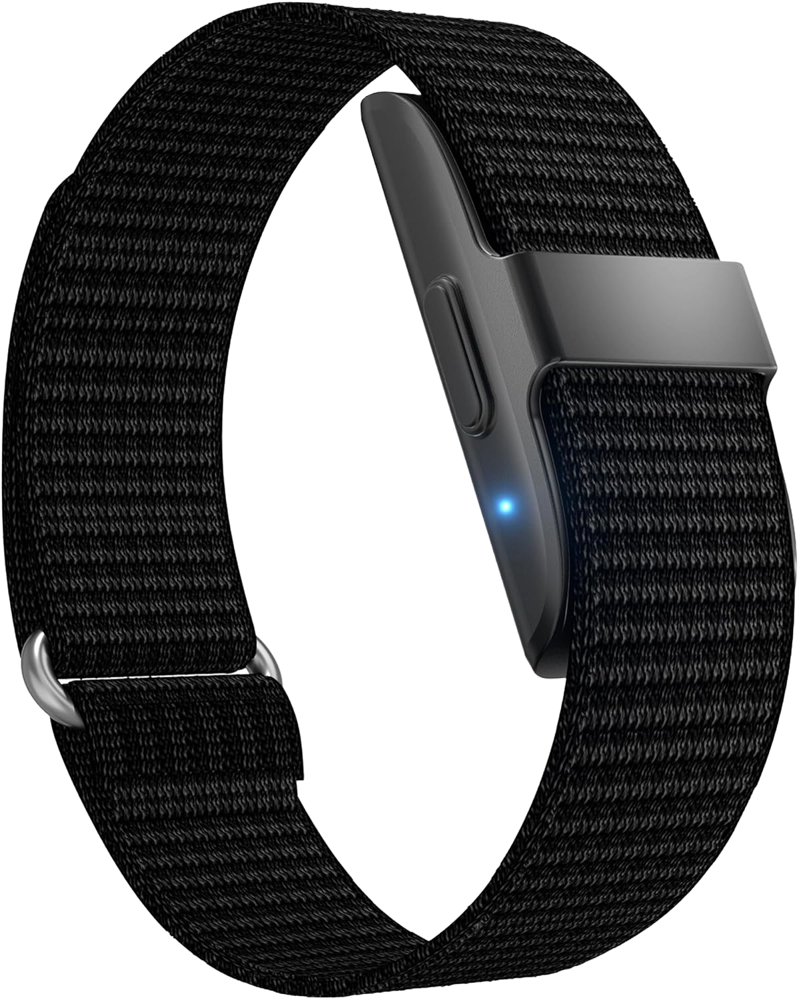

<div align="center">
  
  <br/>
  <h1>AllinBand</h1>
  <h3>Seguridad que te acompaña. Autonomía que te cuida.</h3>
  
  <p>
    <a href="https://trinity-bytes.github.io/AllinBand-Landing/">
      
    </a>
  </p>

  <p>
    
    
    
    
  </p>
</div>

---

## 🏥 Sobre el Proyecto

**AllinBand** es más que una pulsera inteligente; es un sistema integral de cuidado diseñado para brindar **independencia a los pacientes** y **tranquilidad a sus cuidadores**.

En un mundo donde la salud de nuestros seres queridos es prioridad, AllinBand ofrece una solución no intrusiva que monitorea signos vitales 24/7, detecta anomalías mediante Machine Learning y gestiona emergencias de forma automática.

<div align="center">
  
</div>

### 🌟 Propuesta de Valor

- **Para el Paciente:** Vive tu vida con normalidad. La pulsera te cuida en silencio y pide ayuda solo cuando realmente lo necesitas.
- **Para el Cuidador:** Reduce la ansiedad del monitoreo constante. Recibe notificaciones precisas y ubicación en tiempo real solo ante emergencias reales.

---

## ✨ Características Principales

| Funcionalidad          | Descripción                                                                           |
| :--------------------- | :------------------------------------------------------------------------------------ |
| **🚑 Monitoreo 24/7**  | Seguimiento continuo de ritmo cardíaco, oxígeno y temperatura.                        |
| **🤖 Detección IA**    | Algoritmos de Machine Learning que aprenden tus patrones para evitar falsas alarmas.  |
| **📍 Geolocalización** | Envío de ubicación exacta a contactos de emergencia y servicios médicos.              |
| **📱 App Integrada**   | Panel de control para visualizar historial, tendencias y gestionar la red de cuidado. |

---

## 💻 Sección Técnica

Este proyecto ha sido desarrollado siguiendo principios de **Arquitectura Limpia** y **Mobile-First**, priorizando el rendimiento y la accesibilidad.

### 🛠 Stack Tecnológico

- **HTML5 Semántico:** Estructura robusta y accesible (WCAG 2.1 AA).
- **CSS3 Moderno:** Uso extensivo de _Custom Properties_ (Variables CSS), Flexbox y Grid para layouts responsivos sin depender de frameworks pesados como Bootstrap.
- **Vanilla JavaScript:** Lógica de negocio, validaciones y manipulaciones del DOM sin librerías externas para máxima velocidad de carga.

### 🏗 Arquitectura del Proyecto

El código está organizado modularmente para facilitar la escalabilidad y el mantenimiento:

```
📂 css/
 ├── 🎨 variables.css  # Sistema de diseño (Colores, Tipografía, Espaciados)
 ├── 🧩 components.css # Botones, Tarjetas, Badges reutilizables
 ├── 📐 sections.css   # Estilos específicos por sección (Hero, Features, etc.)
 └── 📱 utilities.css  # Clases de utilidad global
```

### 🚀 Performance

- **Zero Dependencies:** Al no usar frameworks, el peso del sitio es mínimo.
- **Lazy Loading:** Implementado en imágenes para mejorar el tiempo de carga inicial.
- **Animaciones Optimizadas:** Uso de `IntersectionObserver` para animaciones de entrada que no bloquean el hilo principal.

---

<div align="center">
  <p>Desarrollado por el equipo <strong>Vivessence</strong></p>
  <p><em>Arquitectura de Computadoras - UPC 2025</em></p>
  
</div>
